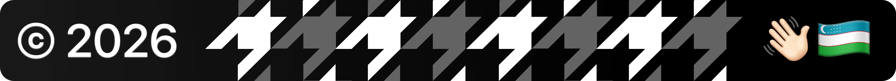

  <a href="#">
    <picture>
      
    </picture>
  </a>

# Me

Hi there, I'm a developer/advocate from Uzbekistan who writes Rust with Nix and do political management & advisoring (sort of consulting) for living at gov.

## Quickstory

Shortly speaking, I "somehow" got into the position where I am right now through years of brute-forcing things to people that I thought to be "true" or let's say "correct" and right now looking forward to fix things where I or things fugged up really hard.

## Now

As a fan of RMS, I delegate Floss Uzbekistan which I'm striving to make it an official governmental party to protect developers' right and bring the "Open Source Licenses" term to Uzbek constitution. Looking forward to witness these days with my own eyes.

Also, I'm department leader at Uzinfocom Open Source, a team of researcher developers who creates stuff within' government's interest and also publishes those very solutions to open source for everybody's use/modification, sometimes our team takes part in global projects and contribute to them. We are only getting started!

  <a href="#">
    <picture>
      
    </picture>
  </a>

