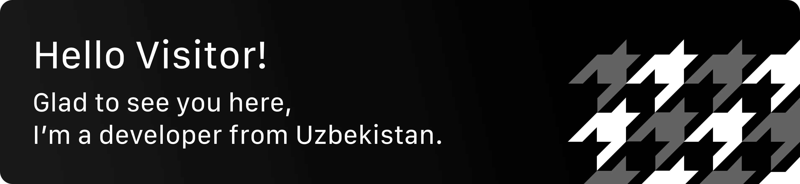

  <a href="#">
    <picture>
      
    </picture>
  </a>

Hi there, I'm a developer/advocate from Uzbekistan who writes Rust with Nix and do political management & advisoring (sort of consulting) for living at gov.

## Quickstory

Shortly speaking, I "somehow" got into the position where I am right now through years of brute-forcing things to people that I thought to be "true" or let's say "correct" and right now looking forward to fix things where I or things fugged up really hard.

## Now

As a fan of RMS, I delegate Floss Uzbekistan which I'm striving to make it an official governmental party to protect developers' right and bring the "Open Source Licenses" term to Uzbek constitution. Looking forward to witness these days with my own eyes.

Also, I'm Chief Technical Advisor and Department Leader at Uzinfocom Open Source, a team of researcher developers who creates stuff within' government's interest and also publishes those very solutions to open source for everybody's use/modification. Sometimes our team takes part in global projects and contribute to them. We are only getting started!

## Logo

I like the design and concept of houndstooth, which is why I adopted houndstooth as my logo. Especially, I like when houndstooth comes in patterns and you can come up with different colors or even pixelate ligatures which makes it look very techy. Black and White pixel perfect or orange CRT'ish pixelated houndstooth is my most favorite ones amongst all combinations.

## Goodbye [GitHub]

You might have mentioned that there are no repositories in my [GitHub] profile. I got fed up from all these unwanted AI thingies getting shoved in my face at [GitHub], so I decided to move to [Codeberg]. Also, after a while I migrated many of the things from [GitHub] to [Codeberg]. My GitHub profile serves me only as a mean of contribution to projects hosted at [GitHub].

## And Then Goodbye Codeberg [UPDATE]

The story continues with me moving to Codeberg only to witness [Codeberg banning LLM and Crypto related projects](https://blog.codeberg.org/protecting-our-floss-commons-from-llms.html) from the platform. Well, jokes aside that was a huge "FAAAAH" moment to me. I'm also not into projects that have AI contributions and personally avoided them at all cost. However, I came to Codeberg seeking "freedom", but when a platform starts restricting certain category of projects and put limitations, well... this doesn't give so called "freedom vibes". Anyways, I moved to [Radicle]!

[GitHub]: https://github.com/orzklv
[Codeberg]: https://codeberg.org/orzklv
[Radicle]: https://look.orzklv.uz

  <a href="#">
    <picture>
      
    </picture>
  </a>

